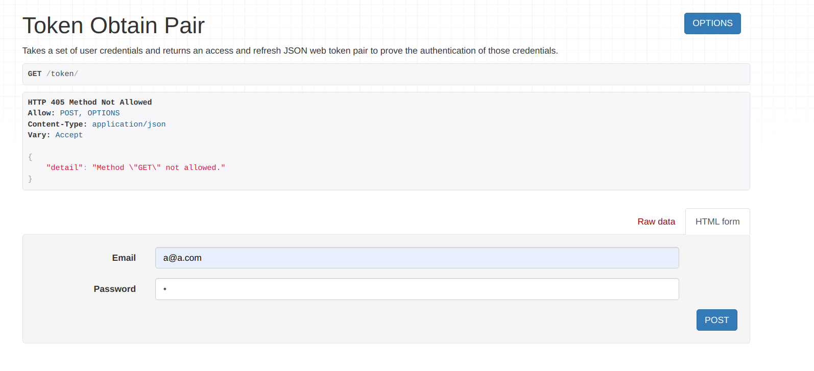

# JWT Authentication with React in Frontend and Django in Backend
In this article, we will build an authentication system. To build the backend, we will using the Django Framework and for frontend React JS framework.

### What JSON Web Tokens (JWT)?

<hr>
<br>

## Django
```
# Python Packages to install
pip install Django
pip install djangorestframework
pip install djangorestframework-simplejwt
pip install django-cors-headers
```

```
# Create the Project.
django-admin startproject jwttoken
```

```
# Create the app.
python manage.py startapp authentication
```

```python
#  setting.py

.....
INSTALLED_APPS = [
     ...........
     'authentication',
     'corsheaders',
     'rest_framework',
     'rest_framework_simplejwt.token_blacklist'
]

.....
CORS_ORIGIN_ALLOW_ALL = True
.....

MIDDLEWARE = [
    'corsheaders.middleware.CorsMiddleware',
    ...........
]
.....

REST_FRAMEWORK = {
     'DEFAULT_AUTHENTICATION_CLASSES': [
        'rest_framework_simplejwt.authentication.JWTAuthentication',
      ],
}
.....

SIMPLE_JWT = {
     'ACCESS_TOKEN_LIFETIME': timedelta(minutes=10),
     'REFRESH_TOKEN_LIFETIME': timedelta(days=1),
     'ROTATE_REFRESH_TOKENS': True,
     'BLACKLIST_AFTER_ROTATION': True
}
```
1. **CORS_ORIGIN_ALLOW_ALL = True:**
This setting enables Cross-Origin Resource Sharing (CORS) for all origins. It allows requests from any origin to access the Django application's resources. CORS is a security mechanism that restricts cross-origin requests, and by setting this to True, all origins are allowed to make requests to the Django application. This can be useful when developing APIs that need to be accessed by different clients from different domains.

2. **MIDDLEWARE with 'corsheaders.middleware.CorsMiddleware':**
This code snippet adds the CorsMiddleware to the list of middlewares used by Django. Middleware in Django is a way to process requests and responses globally before they reach the view or after they leave the view. The CorsMiddleware handles CORS-related headers and allows cross-origin requests by adding the necessary headers to the responses.

3. **REST_FRAMEWORK with 'DEFAULT_AUTHENTICATION_CLASSES':**
This setting configures the Django REST Framework to use JWT authentication as the default authentication class. By specifying 'rest_framework_simplejwt.authentication.JWTAuthentication' in the DEFAULT_AUTHENTICATION_CLASSES setting, it instructs the framework to use JWT tokens for authenticating requests. This ensures that all API endpoints are protected and require a valid JWT token for access.

4. **SIMPLE_JWT configuration:**
This code snippet configures the settings for the Simple JWT library in Django. It sets various options related to the lifetime and behavior of access and refresh tokens. The specific settings are explained in the previous response.

### Setting up the authentication app in django.
```python
# models.py
from django.db import models
from django.contrib.auth.models import AbstractUser, BaseUserManager

# Create your models here.
from django.contrib.auth.models import BaseUserManager

class UserManager(BaseUserManager):
    def _create_user(self, email, password=None, **extra_fields):
        if not email:
            raise ValueError("The Email field must be set.")
        email = self.normalize_email(email)
        user = self.model(email=email, **extra_fields)
        user.set_password(password)
        user.save(using=self._db)
        return user

    def create_user(self, email, password=None, **extra_fields):
        extra_fields.setdefault("is_staff", False)
        extra_fields.setdefault("is_superuser", False)
        return self._create_user(email, password, **extra_fields)

    def create_superuser(self, email, password=None, **extra_fields):
        extra_fields.setdefault("is_staff", True)
        extra_fields.setdefault("is_superuser", True)
        if extra_fields.get("is_staff") is not True:
            raise ValueError("Superuser must have is_staff=True.")
        if extra_fields.get("is_superuser") is not True:
            raise ValueError("Superuser must have is_superuser=True.")
        return self._create_user(email, password, **extra_fields)


class User(AbstractUser):
    name = models.CharField(max_length=250)
    email = models.CharField(max_length=250, unique=True)
    password = models.CharField(max_length=250)

    username = None
    USERNAME_FIELD = 'email'
    REQUIRED_FIELDS = []

    objects = UserManager()
```
```python
# serializers.py
from rest_framework import serializers
from .models import User

class UserSerializer(serializers.ModelSerializer):
    class Meta:
        model = User
        fields = ['id', 'name', 'email', 'password']
        
    def create(self, validated_data):
        password = validated_data.pop("password")
        instance = self.Meta.model(**validated_data)
        if password is not None:
            instance.set_password(password)
        instance.save()
        return instance
```

### Other Backend codes:
```python
# Apply migrations
python3 manage.py makemigrations
python3 manage.py migrate

# Create superuser
python3 manage.py createsuperuser
```

```python
# urls.py in jwttoken project
from django.contrib import admin
from django.urls import path, include
from rest_framework_simplejwt import views as jwt_views

urlpatterns = [
    path('admin/', admin.site.urls),
    path('user/', include('authentication.urls')),
    path('token/', jwt_views.TokenObtainPairView.as_view(), name ="token_obtain_pair"),
    path('token/refresh/', jwt_views.TokenRefreshView.as_view(), name="token_refresh"),
]
```
1. **path('token/', jwt_views.TokenObtainPairView.as_view(), name='token_obtain_pair'):**
This URL pattern maps the /token/ endpoint to the TokenObtainPairView view from the jwt_views module. This view is responsible for generating a JWT access token and a refresh token when a user provides valid credentials. 
2. **path('token/refresh/', jwt_views.TokenRefreshView.as_view(), name='token_refresh'):**
This URL pattern maps the /token/refresh/ endpoint to the TokenRefreshView view from the jwt_views module. This view is used to refresh an expired access token by providing a valid refresh token. It generates a new access token and returns it to the client. 

### Testing Backend Django configurations
```python
# Starting the server
python3 manage.py runserver
```
In browser navigate to: http://localhost:8000/token/

Give a email and password in the provided fields and click post.

<br>


A refresh token and an access toke is returned from the backed.

<br>

Go to: http://localhost:8000/token/refresh/ and provide the refresh token from the previous response.


<br>


A new access token is returned. This access token is created after checking the refresh token.

### Setting up django views and urls

In App (authentication) urls.py
```python
urlpatterns = [
    path('register', RegisterView.as_view(), name="register"),
    path('login', Loginview.as_view(), name="login"),
    path('logout', LogoutView.as_view(), name = "logout")
]
```
<br>

In App(authentication) views.py

```python
from django.shortcuts import render
from rest_framework.views import APIView
from .serializers import UserSerializer
from rest_framework.response import Response
from rest_framework.exceptions import AuthenticationFailed
from .models import User
from rest_framework_simplejwt.tokens import AccessToken, RefreshToken, TokenError
from rest_framework import status


class RegisterView(APIView):
    def post(self, request):
        serializer = UserSerializer(data = request.data)
        serializer.is_valid(raise_exception=True)
        serializer.save()
        return Response(serializer.data)

class Loginview(APIView):
    def post(self, request):
        email = request.data["email"]
        password = request.data["password"]
        
        try:
            user = User.objects.get(email = email)
        except User.DoesNotExist:
            raise AuthenticationFailed("Account does  not exist")

        if user is None:
            raise AuthenticationFailed("User does not exist")
        if not user.check_password(password):
            raise AuthenticationFailed("Incorrect Password")
        access_token = AccessToken.for_user(user)
        refresh_token =RefreshToken.for_user(user)
        return Response({
            "access_token" : access_token,
            "refresh_token" : refresh_token
        })
    
class LogoutView(APIView):
    def post(self, request):
        try:
            refresh_token = request.data['refresh_token']
            if refresh_token:
                token = RefreshToken(refresh_token)
                token.blacklist()
            return Response("Logout Successful", status=status.HTTP_200_OK)
        except TokenError:
            raise AuthenticationFailed("Invalid Token")
```

<br>
<hr><hr>
<br>

## React
#### Start a react app
To start a new react app, run the code in the terminal

```react
npx create-react-app frontend
cd frontend
```

Install necessary dependencies.
```react
npm i bootstrap
npm i axios
npm i react-router-dom
```
#### Create the following components.
#### **Home**
```javascript
const Home = () => {
    return(
        <div>
            <h1>
                Home page
            </h1>
        </div>
    )
}
export default Home;
```
<br> 

#### **Login**
```javascript
import React, {useState} from 'react';
import Cookies from 'js-cookie';
import axios from 'axios';
import 'react-bootstrap';
import 'bootstrap/dist/css/bootstrap.min.css';
import {useNavigate} from 'react-router-dom';

const Login = () => {
    const [email, setEmail] = useState("")
    const [password, setPassword] = useState("")
    const navigate = useNavigate();


    const submit = async (e) => {
      e.preventDefault();
      const user = {
        email : email,
        password: password
      }
      try {
        const {data} = await axios.post("http://localhost:8000/token/", user)
        
        // Storing Access in cookie
        Cookies.set('access_token', data.access);
        Cookies.set('refresh_token', data.refresh);
        navigate("/");
      }
      catch (error) {
        console.error("error in token fetch: ", error.message)
      }

    }
    

    return(
        <div className="Auth-form-container">
          <form className="Auth-form" onSubmit={submit}>
            <div className="Auth-form-content">
              <h3 className="Auth-form-title">Sign In</h3>
              <div className="form-group mt-3">
                <label>Email</label>
                <input className="form-control mt-1" 
                  placeholder="Enter Email" 
                  name='email'  
                  type='email' value={email}
                  required 
                  onChange={e => setEmail(e.target.value)}/>
              </div>
              <div className="form-group mt-3">
                <label>Password</label>
                <input name='password' 
                  type="password"     
                  className="form-control mt-1"
                  placeholder="Enter password"
                  value={password}
                  required
                  onChange={e => setPassword(e.target.value)}/>
              </div>
              <div className="d-grid gap-2 mt-3">
                <button type="submit" 
                   className="btn btn-primary">Submit</button>
              </div>
            </div>
         </form>
       </div>
       )
};
export default Login;  
```
Here two states (email and password) is created using useState() hook to store the value of email and password entered by the user in the input field. when the submit button is pressed, the submit() function is called and e.preventDefault prevent the default form submission by javascript.
A user object is created which contains the username and password entered by the user. Then axios is used to send the data to the remote server using async and await. In axios the first parameter is the url and the second parameter is the data to be send. The return from axios is stored in the data object.
Since JWT token is only stored in the client side, we used 'js-cookie' library to store the token in a cookie.  

<br> 

#### **Navigation**
```javascript
import Nav from 'react-bootstrap/Nav';
import Navbar from 'react-bootstrap/Navbar';
import React, { useEffect, useState } from 'react';
import 'bootstrap/dist/css/bootstrap.min.css';
import Cookies from 'js-cookie';
import { Link, NavLink } from 'react-router-dom';

export function Navigation() {
  const [isAuth, setIsAuth] = useState(false);
  console.log(isAuth);

  useEffect(() => {
    const access_token = Cookies.get('access_token');
    setIsAuth(!!access_token);
  }, [isAuth]);

  return (
    <div>
      <Navbar bg="dark" variant="dark">
        <Navbar.Brand as={Link} to="/">
          JWT Authentication
        </Navbar.Brand>
        <Nav className="me-auto">
          {isAuth && (
            <Nav.Link as={NavLink} to="/" exact activeClassName="active">
              Home
            </Nav.Link>
          )}
        </Nav>
        <p style={{ color: 'white' }}>isAuth: {isAuth.toString()}</p>
        <Nav>
          {isAuth ? (
            <Nav.Link as={NavLink} to="/user/logout" exact activeClassName="active">
              Logout
            </Nav.Link>
          ) : (
            <Nav.Link as={NavLink} to="/user/login" exact activeClassName="active">
              Login
            </Nav.Link>
          )}
        </Nav>
      </Navbar>
    </div>
  );
}

```
<br>

#### **App.js**
```javascript
import { Navigation } from "./component/navigations";
import { BrowserRouter as Router, Route, Routes } from 'react-router-dom'
import Home from './component/Home'
import Login from "./component/Login";
import Logout from "./component/Logout";


const App = () => {
    return (
        <Router>

            <Navigation />
            
            <Routes>
                <Route exact path="/" element={< Home />} />
                <Route path="/user/login/" element={<Login />} />
                <Route path="/user/logout/" element={< Logout />} />

            </Routes>
        </Router >

    )
}
export default App;
```

Start the app
```react
npm start
```

Then open http://localhost:3000/ to see the app.

After opening [http://localhost:8000/token/](http://localhost:8000/token/) in and sending a valid email and password, a cookie will be created in the browser. 


<hr>
<br>

### Some key points about JWT storage.
> A JWT needs to be stored in a safe place inside the user’s browser. If you store it inside localStorage, it’s accessible by any script inside your page. This is as bad as it sounds; an XSS attack could give an external attacker access to the token.To keep them secure, you should always store JWTs inside an httpOnly cookie. This is a special kind of cookie that’s only sent in HTTP requests to the server. It’s never accessible (both for reading or writing) from JavaScript running in the browser.

[Great article on JWT tokens in mobile apps](https://tech.justeattakeaway.com/2019/12/04/lessons-learned-from-handling-jwt-on-mobile/)

### Considering future implementation with mobile Apps.
Considering that you want to implement a headless architecture where the data can be accessed by both mobile apps and web apps simultaneously, sending the token as a raw token is a common approach. This allows more flexibility in handling cross-domain requests and sharing tokens between different client applications.

